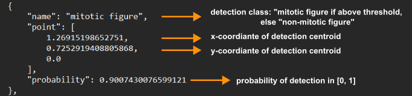
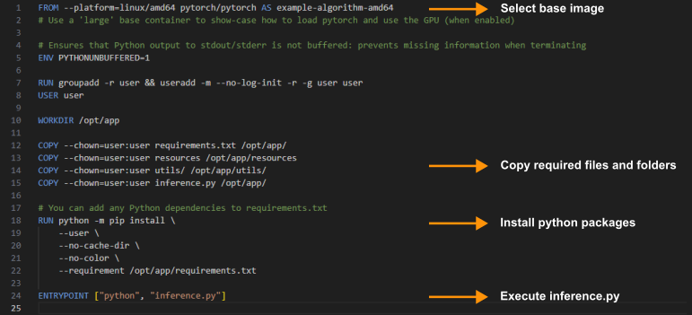
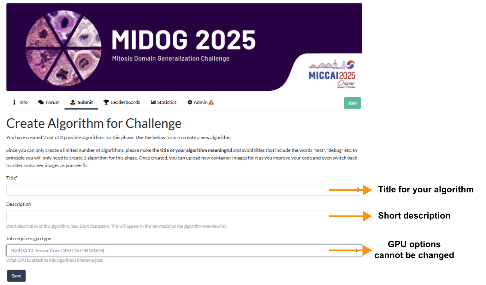
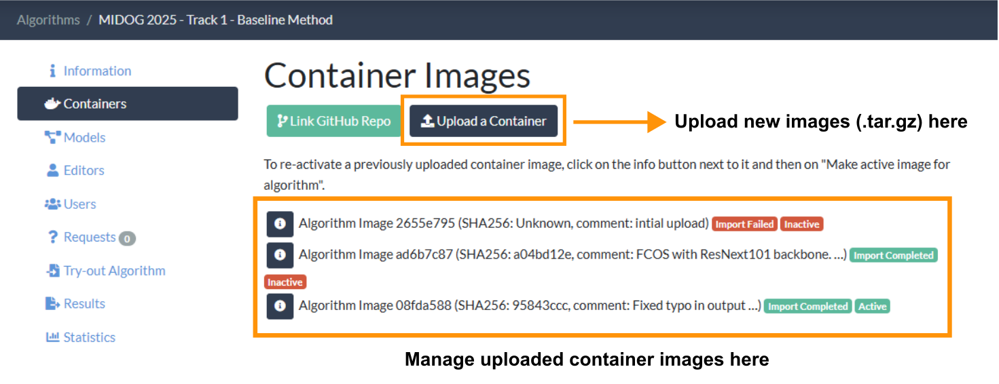
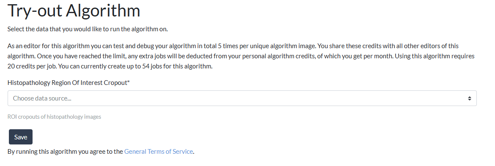

# MIDOG 2025 Track 1 Reference Algorithm Docker Image

Credits: J. Ammeling, F. Wilm, K. Breininger, M. Aubreville

Welcome to the MIDOG 2025 reference docker for track 1. This docker image contains a reference implementation of a Fully Convolutional One-Stage Object Detection model (FCOS) based on the [Torchvision implementation](https://github.com/jonas-amme/FCOS_Inference_CLI), provided by Jonas Ammeling (Technische Hochschule Ingolstadt, Germany) for the MIDOG 2025 challenge. 

The container shall serve as an example how we (and the grand-challenge plattform) expect the outputs to look like. At the same time, it serves as a template for you to implement your own algorithm for submission to MIDOG 2025. 

For reference, you may also want to read the blog post of grand-challange.org on [how to create an algorithm](https://grand-challenge.org/documentation/create-your-own-algorithm/).

## Content:
1. [Prerequisites](#prerequisites)
2. [An overview of the structure of this example](#overview)
3. [Packing your algorithm into a docker container image](#todocker)
4. [Testing your container](#test)
5. [Generating the bundle for uploading your algorithm](#export)
6. [Creating an "Algorithm" on GrandChallenge and submitting your solution to the MIDOG Challenge](#submission)

## 1. Prerequisites <a name="prerequisites"></a>

The container is based on docker, so you need to [install docker first](https://www.docker.com/get-started). 

Second, you need to clone this repository:
```
git clone git@github.com:DeepMicroscopy/MIDOG25_T1_reference_docker.git
```

Create a virtual environment to install all the dependencies and then download the weights for the reference algorithm if you want to run the docker container with the provided model. 
```
cd MIDOG25_T1_reference_docker
python -m venv env
source env/bin/activate
pip install -r requirements.txt
python download_weights.py
```

Optional: If you want to have GPU support for local testing, you want to install the [NVIDIA container toolkit](https://docs.nvidia.com/datacenter/cloud-native/container-toolkit/install-guide.html)

As stated by the grand-challenge team:
>Windows tip: It is highly recommended to install [Windows Subsystem for Linux (WSL)](https://docs.microsoft.com/en-us/windows/wsl/install-win10) to work with Docker on a Linux environment within Windows. Please make sure to install WSL 2 by following the instructions on the same page. In this tutorial, we have used WSL 2 with Ubuntu 18.04 LTS. Also, note that the basic version of WSL 2 does not come with GPU support. Please [watch the official tutorial by Microsoft on installing WSL 2 with GPU support](https://www.youtube.com/watch?v=PdxXlZJiuxA). The alternative is to work purely out of Ubuntu, or any other flavor of Linux.

## 2. An overview of the structure of this example <a name="overview"></a>

This reference algorithm implements a [Fully Convolutional One-Stage](https://arxiv.org/abs/1904.01355) object detection model. The implementation is based on the torchvision library. 
- The main inference logic is provided in the [utils/inference_utils.py](utils/inference_utils.py). It provides a dataset class (`ROI_InferenceDataset`) to load an image and perform inference on it with overlapping patches. The `Torchvision_Inference` class takes as input a torchvision-based model, e.g. an FCOS model, and performs the inference steps. The `process_image` function takes an `SimpleITK` image as input, creates the inference dataset, runs the model over the patches, performs post-processing steps, and returns the detections. The `DetectionAlgorithm` class puts all the things together. It loads the model, initializes the inference strategy and performs the inference steps. The `predict` function calculates the final output in the format required by grand-challenge.org. 
- The main file that is executed by the container is [inference.py](inference.py). It loads the test image as `SimpleITK` image. It imports and initializes the `DetectionAlgorithm`. It then performs the inference with the `predict` function and returns the dictionary with the final results, which are ultimately stored in the file `/output/mitotic-figures.json`. 

The output file is a dictionary (each input file is processed independently), and has the following format:

```
{
    "type": "Multiple points",
    "points": [
        {
            "point": [
                0.14647372756903898,
                0.1580733550628604,
                0,
            ],
            "probability" : 0.534,
            "name" : "mitotic figure",
        },
        {
            "point": [
                0.11008273935312868,
                0.03707331924495862,
                0,
            ]
            "probability" : 0.302839283,
            "name" : "non-mitotic figure",
        }
    ],
    "version": {
        "major": 1,
        "minor": 0
    }
}
```

Note that each point is described by the following dictionary:



The field "name" is used to distinguish between above threshold detections and below threshold detections. Please make sure that you find a suitable detection threshold. The below threshold detections are part of the output to calculate the average precision metric.

## 3. Embedding your algorithm into an algorithm docker container <a name="todocker"></a>

We encourage you to adapt this example to your needs and insert your mitosis detection solution. You can adapt the code, remove & code files as needed and adapt parameters, thresholds and other aspects. As discussed above, the main file that is executed by the container is [inference.py](inference.py).

If you need a different base image to build your container (e.g., Tensorflow instead of Pytorch, or a different version), if you need additional libraries and to make sure that all source files (and weights) are copied to the docker container, you will have to adapt the [Dockerfile](Dockerfile) and the [requirements.txt](requirements.txt) file accordingly.

Kindly refer to the image below to identify the relevant points:



## 4. Testing your container <a name="test"></a>

To test your container, you should run `do_test_run.sh`. This will run the test image provided in the test folder through your model. It will check the result against what you provide in `test/ouput/expected_output.json`. Be aware that you will need to adapt the `expected_ouput.json` to your own expected results when you modify the algorithm.  

## 5. Generating the bundle for uploading your algorithm <a name="export"></a>

When your test run finishes successfully you can run the `do_save.sh` script to create a file that prepares your docker image for uploading it to grand-challenge.org. It will create file with the extension "tar.gz" that you need to upload to the challenge. 


## 6. Creating an "Algorithm" on GrandChallenge and submitting your solution to the MIDOG Challenge <a name="submission"></a>

**Note: Submission to grand-challenge.org will open on August 15th.**

Please be reminded that only **verified users** will be able to submit to the challenge (as written [here](https://grand-challenge.org/documentation/making-a-challenge-submission/#submission-tips)). If you used an educational email address in the sign up process, this will be much quicker. You can find all information about the account verification [at this link](https://grand-challenge.org/documentation/verification/).


In order to submit your docker container, you first have to add an **Algorithm** entry for your docker container [here] https://midog2025.grand-challenge.org/evaluation/track-1-object-detection-preliminary-evaluation-phase/algorithms/create/.

Please enter a name for the algorithm:



After saving, you can add your docker container (you can also overwrite your container here):



Please note that it can take a while (several minutes) until the container becomes active. You can determine which one is active in the same dialog. 

You can also try out your algorithm. Please note that you will require an image that has the DPI property set in order to use this function. You can use the image test/007.tiff provided as part of this container as test image (it contains mitotic figures).




Final submission to a phase will be updated soon!!!
